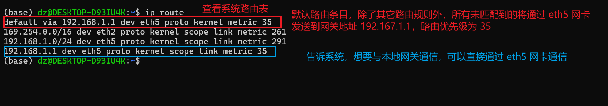

## 计算机网络中常见的概念/术语

### IP

简单来说就是在网络中标识一个特定的网络设备。但由于IP往往不够用，所以一般是这么做的。想象这么一个场景，有一个电脑机房，有很多电脑。我们会拿出一个IP，叫做公网IP，用于与外部互联网进行访问。再弄个路由器或者交换机，分配很多个IP，给本地的电脑一个电脑一个IP，叫做局域网IP。这就是IP的大致作用了。

### 网关

网关（Gateway）是连接两个网络的设备或者程序。它可以是硬件设备，如路由器或交换机，也可以是运行特定网络协议的软件程序。网关负责在不同网络之间传输数据，并且在需要时将数据进行转换、路由或过滤，以确保数据能够正确地从一个网络传输到另一个网络。

简单来说，网关就是用来连接局域网（LAN）和广域网（WAN）的。

> ipv4网关为192.168.1.1的含义？
>
> 当局域网中的设备要访问Internet或其他网络上的资源时，它们会发送数据到网关（即192.168.1.1），网关负责将数据路由到目标网络。

### 子网掩码

于确定一个IP地址中哪些位用于标识网络部分，哪些位用于标识主机部分。一般和IP一起使用。

> 子网掩码为255.255.255.0的含义？
>
> 在IPv4地址中，这个子网掩码表示前24位（即前三个八位组）用于标识网络部分，而最后8位用于标识主机部分。
>
> 最后一个十进制0，表示二进制的8个0，表示后面8个位用于识别主机，所以可以支持256个主机地址。

### 主机中的多个网络设备

当我们使用 `ipconfig` 时，会发现有很多网卡。那么一个主机中的多个网卡是如何协调工作的呢？一个http请求该走哪个网卡？

#### 使用 ip route 查看系统路由表

