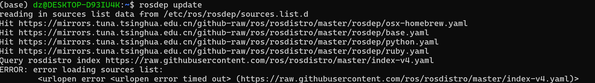
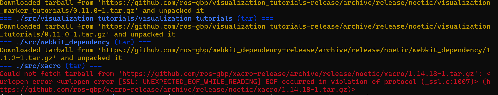
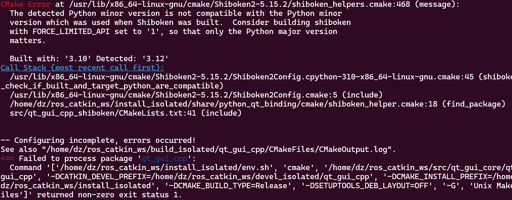

## 安装

参考 ROS 官网文档：https://wiki.ros.org/noetic/Installation/Source


安装完成之后，使用这一行命令就能引用 ros1 了

``` bash
source ~/ros_catkin_ws/install_isolated/setup.bash
```

或者用 colcon 构建的

``` bash
source ~/ros_catkin_ws/install/setup.bash
```


当出现错误时，尝试修正中，可以使用 `catkin_build_isolated <pkg name>` 避免繁琐的所有包构建


## 常见问题

> rosdep update 报错，网络问题



原因：网络被墙，考虑使用 rosdepc 或者开 VPN 再尝试


> `vcs import --input noetic-desktop.rosinstall ./src` 命令会很慢，且报错



原因：依然是网络被墙，方法同上


> ROS包编译报错 No module named catkin_pkg.package

[ROS包编译报错 No module named catkin_pkg.package_no module named 'catkin_pkg.package-CSDN博客](https://blog.csdn.net/qq_39779233/article/details/107446258)


> error: option --install-layout not recognized

[error: option --install-layout not recognized，在编译的时候出问题报错-CSDN博客](https://blog.csdn.net/pvmsmfchcs/article/details/128655947)


> Poco was not found.  Set the Poco_INCLUDE_DIR cmake cache entry to the
>   top-level directory containing the poco include directories.

``` bash
sudo apt install libpoco-dev
```


> rosconsole: Error when compiling with log4cxx

https://github.com/ros/rosconsole/pull/54


> qt_gui_cpp:  The detected Python minor version is not compatible with the Python minor
>   version which was used when Shiboken was built. 
>
> Consider building shiboken
>   with FORCE_LIMITED_API set to '1', so that only the Python major version
>   matters.



原因：python版本不满足造成的，可以指定 python 工具完成

https://forum.freecad.org/viewtopic.php?t=45081


> <== Failed to process package 'qt_gui_cpp':
>   Command '['/home/dz/ros_catkin_ws/install_isolated/env.sh', 'make', '-j12', '-l12']' returned non-zero exit status 2.


didn't work:

1. https://answers.ros.org/question/249981/building-catkin-workspacefailed-to-process-package-qt_gui_cpp/

2. 安装相关依赖 python-sip-dev

   ```bash
   sudo apt-get install sip-dev pyqt5-dev python-sip-dev pyqt5-dev-tools
   ```

   

>  No module named sipconfig

解决：跳过这个包的构建。。。

didn't work:

不能直接用 pip，注意给 sudo 权限

[No module named sipconfig_no module named 'sipconfig-CSDN博客](https://blog.csdn.net/appleyuchi/article/details/78542517)

https://stackoverflow.com/questions/11841962/cant-configure-pyqt


全是 BUG ！！！，想起来还有 docker😆😆😆